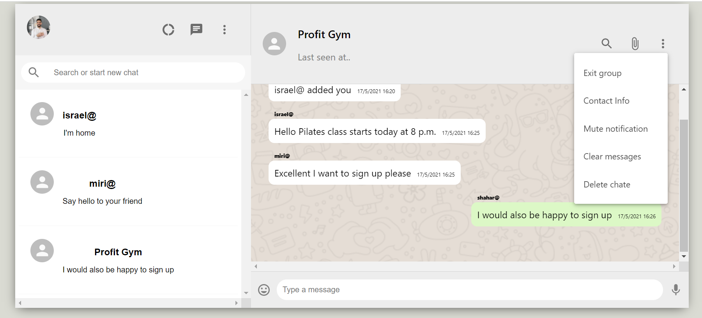

# Messenger Application (“WhatsApp alike” )
Live Application [_here_](https://messenger-app-realtime.netlify.app/).

## Table of Contents
* [General Info](#general-information)
* [Technologies Used](#technologies-used)
* [Features](#features)
* [Screenshots](#screenshots)

## General info
A web application for instant messaging that allows each user to send private messages (to another user) and create new groups. Using SOCKET.IO for real
time communication between web clients and server.
### - Server side: 
Web service - Node.js using Express package , with five layers controller, routes, BL, DAL, model.
The server manage databases implemented by MongoDB and express-jwt for authentication.
### - Client side: 
Developed in React, the global state managed by context API hook and the design
implemented in styled-components.

## Technologies Used
Project is created with:
* Node.js using Express package.
* SOCKET.IO.
* MongoDB.
* Express-jwt.
* React.
* Context API Hook.
* Styled-Components.
* Material-UI.

## Features
* A Login page for the registered users.
* Each user can send message to any other user
* Each user can create a Group and add other users to that group
* Each user can get message from any other user and messages to the groups he’s a
member at.
* Each user can exit leave a group.
* Each user can watch a list of all the groups he’s member of.
* Each user can block and unblock other users.
* The calls are sorted automatically according to the order in which they were sent or received in reality.
* Indication for sending or receiving a message - The background of the received message will be white and the background of the sent message will be green.

## Screenshots
#### Login: 

#### Main: 

#### Chat: 

#### Create Group: 

#### Block/UnBlock user: 

#### Exit Group: 

